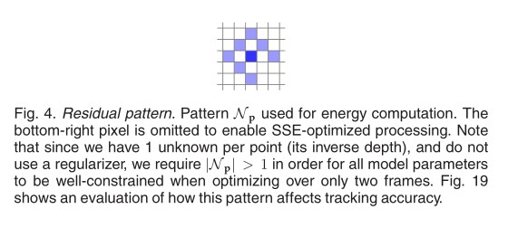

## 滑动窗口
DSO 维护一个滑动窗口，通常由5-7个关键帧组成，DSO试图将每个先前关键帧中的地图点投影到新关键帧中，形成残差项。同时，会在新关键帧中提取未成熟点，并希望它们演变成正常地图点。在实际当中，由于运动、遮挡的原因，部分残差项会被当作outlier，最终剔除；也有部分未成熟地图点无法演化成正常地图点，最终被剔除。   
其内部是一个非线性最小二乘问题，表示为因子图（图优化）的形式如下图。

每个关键帧 KF 是八维的，包含六自由度的位姿T和两个描述光度的参数a,b。每个地图点 Pt 仅由其**逆深度** $d_p$ 表示。每个残差项关联两个关键帧和一个逆深度，以及全局相机内参（未表示）。  
蓝色对应的为**主导帧**，红色对应的为**目标帧**。

## 残差函数（能量函数）
考虑一个主导帧 $I_i$ 中的像素点和目标帧 $I_j$ 中被观测的像素点，两者通过一个小邻域包含的像素计算光度误差作为残差项,其总和称为SSD。这个邻域包含8个像素点。  

残差函数 $E_{pj}$ 的值主要取决于四部分变量
1. 目标像素的逆深度 $d_p$
2. 相机内参 $c$
3. 相关两帧的位姿 $T_i$ 和 $T_j$
4. 亮度传递函数参数 $a_i、b_i、a_j、b_j$(这些参数描述曝光)    

公式如下：   

其 $p'$ 是 $p$ 在目标帧上投影像素坐标。
$$
\begin{equation}
d_{ph}^{-1}p=KP_h
\end{equation}
$$
$$ 
\begin{equation}\begin{split}
d_{pt}^{-1}p'&=KT_{TW}T_{HW}^{-1}K^{-1}d_{ph}^{-1}p \\
&=KT_{TW}T_{HW}^{-1}P_h \\
&=K(R_{TH}P_h+t_{TH})

\end{split}\end{equation}
$$
$P_h$ 为目标帧位姿相机坐标系下的点的空间坐标，上述推导隐含齐次到非齐次的转化，可得到 $p'$。对 $T_{HW}$ 等变换的理解可以表述为一个由W坐标系表示的向量经过 $T_{HW}$ 欧式变换，从而通过H坐标系来表示。

## 雅可比
通过最优化方法求解因子图的最小二乘问题，利用高斯牛顿法。
$$
H=J^TWJ  \ \ \ \ \ \  and \ \ \ \ \ \ b=-J^TWr 
$$
$r\in R^{n\times n}$ 表示残差项，$J\in R^{n\times d}$为残差项的雅可比矩阵，$W\in R^{n\times n}$为权重矩阵。